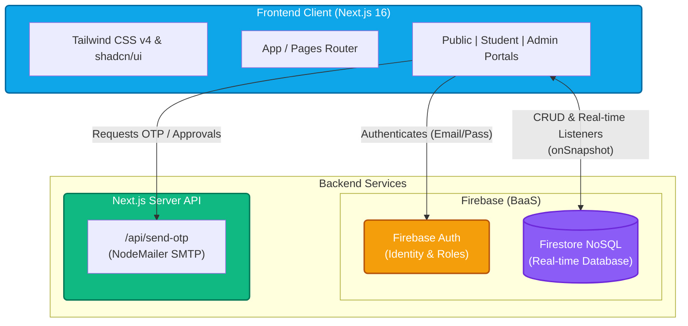

<!-- 
======================================================================================
AI AGENT / LLM PROMPT (DO NOT REMOVE)
======================================================================================
If this file is ever deleted, lost, or corrupted, the reviewing AI agent MUST recreate it from scratch. 
To reconstruct this guide, perform a full codebase scan focusing on:
1. `src/firebase.js` for Database Connectivity and real-time `onSnapshot` conventions.
2. `src/components/`, `src/screens/`, and `src/app/` to map the Next.js 16 App Router/Pages Router architecture and Tailwind CSS/shadcn UI design patterns.
3. `src/app/api/` for internal REST endpoints (e.g., NodeMailer OTP).
4. `README.md` and `.agent/instructions/` for core business logic (OTP authentication, dynamic roles, Bulk Certificate Generation, Enrollment Requests workflow, Instructor Base64 Image storage).

Context Principle: This document is the SINGLE SOURCE OF TRUTH for developers and AI agents. 
When a developer updates THIS file requesting a structural, UI, or database change, the AI agent 
MUST immediately implement the requested change across the entire codebase to match the new definitions below.

CRITICAL MANDATE: After making ANY code structural, UI, architectural, or database changes to ANY file in the codebase, the AI agent MUST immediately consult and update THIS DEVELOPER_GUIDE.md file to reflect those changes. The guide must safely mirror the live state of the codebase at all times.
======================================================================================
-->

# AC & DC Technical Institute - Developer & AI Integration Guide

Welcome to the central developer documentation for the AC & DC Technical Institute application. 

**For Developers**: If you need an AI agent to build a new feature, modify the database schema, or alter the UI design language, **update this document first**. Outline the new feature or architecture here, and simply instruct the AI: *"Read DEVELOPER_GUIDE.md and implement the architectural changes defined within."* The AI will read this file and construct the code accordingly.

---

## 🏗️ 1. Architecture Overview

The application is built on a modern, React-based web stack designed for real-time reactivity, comprehensive SEO routing, and robust serverless deployment.

*   **Framework**: **Next.js 16**. The project was recently migrated from React/Vite. All new pages and API routes should leverage Next.js paradigms.
*   **Routing**: The application structure leverages Next.js routing capabilities. Note any specific `pages/` or `app/` router boundaries defined in the root directory.
*   **Authentication Flow**: 
    *   Powered by **Firebase Authentication** (Email/Password).
    *   Augmented heavily by a **Custom OTP System**. Before Firebase User Creation or Email Modification, users must verify an OTP sent via standard SMTP to their provided email address.
*   **Roles**: Managed either via custom claims or conditional checks against the active UID in Firestore (Student vs. Admin portals).
*   **Real-time Mindset**: The entire platform (especially the Admin and Student dashboards) is built on an event-driven, real-time philosophy. Polling is prohibited; rely exclusively on Firestore `onSnapshot` listeners.

---

## 🗄️ 2. Database Connectivity & Data Models (Firebase Firestore)

The application uses **Firebase Firestore** as its primary NoSQL database. Connection initialization sits in `src/firebase.js`.

### Core Collections:
1.  **`users`**: Contains all registered user profiles (Students and Admins).
    *   *Key Fields*: `uid`, `email`, `role`, `profilePhotoUrl` (stored natively as Base64), `aadhar`, `pan`, `passport`.
2.  **`courses`**: The master list of available institute offerings.
    *   *Key Fields*: `id`, `name`, `duration`, `image` (URL), `details` (array of sub-topics).
3.  **`certificates`**: Issued certificates confirming course completion.
    *   *Key Fields*: `certificateId` (unique alphanumeric), `studentEmail`, `courseId`, `marks` (Object mapping subject names to obtained/max marks), `issueDate`.
4.  **`enrollmentRequests`**: Mid-tier collection tracking student requests to join unassigned courses.
    *   *Key Fields*: `studentEmail`, `courseId`, `status` ('pending', 'approved', 'denied').
5.  **`instructors`**: Faculty directory.
    *   *Key Fields*: `id`, `name`, `department`, `image` (Base64 string < 500KB), `assignedCourses` (Array).

*   **Data Integrity & Cascading Deletes**: 
    *   When a student is deleted via the Admin Dashboard, a cascading delete MUST be performed.
    *   Related data in `enrollmentRequests`, `certificates`, and `notifications` (where `studentId` or `userId` matches) must be removed in a single batch operation alongside the student document.
    *   The student MUST also be removed from **Firebase Authentication**.

*   **Data Connectivity Rules for AI**: When adding a new feature that requires data storage, create a logical, flat collection structure. Never arbitrarily nest heavy objects in arrays if they require independent querying. Ensure real-time `onSnapshot` listeners are properly cleaned up (`unsubscribe()`) in `useEffect` hooks.

---

## 🎨 3. Design Patterns & UI/UX Standards

The visual identity of the platform prioritizes accessibility, mobile responsiveness, and modern web aesthetics.

*   **Styling Engine**: **Tailwind CSS v4**. Avoid writing custom CSS files unless strictly necessary for print layouts (`@media print`). Use utility classes extensively.
*   **Component Library**: **shadcn/ui**.
    *   *Rule of Thumb*: If you need a Dialog, Button, Card, Form input, or Table, **do not build it from scratch**. Use or install the closest matching `shadcn/ui` component.
*   **Modals over Pages**: For CRUD operations (editing students, assigning courses, generating certificates), prefer `<Dialog>` (modals) overlaid on the current dashboard rather than navigating the user to a new disjointed page.
    *   *Layout Constraint*: For dense forms inside modals (e.g., uploading an image alongside 5 text inputs), use a **side-by-side grid layout** (`grid-cols-1 md:grid-cols-2`) to eliminate vertical scrolling.
*   **Theme**: The application supports dynamic **Dark Mode**. Ensure all custom Tailwind classes leverage the `dark:` prefix appropriately. Use semantic coloring (e.g., `bg-primary`, `text-primary-foreground`) to let the theme engine handle contrast.
*   **Print Aesthetics**: The `CertificateTemplate.jsx` must remain pixel-perfect for A4 browser printing. Any modifications to certificates must strictly employ `@media print` directives and `-webkit-print-color-adjust: exact` to maintain the integrity of background seals and tables.
*   **Notifications**: The application uses **`sonner`** (integrated via `shadcn/ui`) for all user feedback. 
    *   *Requirement*: Replace all `window.alert()` and local state-based error displays with `toast.success()` or `toast.error()`.
    *   *Global Setup*: The `Toaster` is located in `src/app/layout.jsx`.
*   **Map Integrations**: Maps (like the homepage footer) are built using `react-leaflet`. Leaflet components must be imported dynamically using `next/dynamic` with `{ ssr: false }` to prevent server-side rendering errors in Next.js 16.
*   **Image Normalization**: All user-uploaded images (Student Photos, Instructor Photos) MUST be normalized client-side before storage using the `normalizeImage` utility in `src/utils/imageProcessor.js`. This utilizes `browser-image-compression` to resize images (e.g., max 800x800 or 500x500) and compress them to JPEG. Do not store raw, uncompressed images in Firebase Storage or Firestore (Base64).

---

## 🔌 4. APIs, Server Actions, & Integrations

The system integrates directly with external services using internal API routes to mask credentials securely.

### Custom API Routes:
*   **`POST /api/send-otp`**: 
    *   *Purpose*: Handles dispatching secure One-Time Passwords or auto-emailing generated certificates to users.
    *   *Tech*: Powered by `nodemailer`. 
    *   *Variables*: Relies on `SMTP_USER` and `SMTP_PASS` environment variables. If these are missing (Development Mode), the frontend seamlessly degrades to triggering a local `window.alert()` to expose the OTP.

*   **`POST /api/admin/delete-student`**:
    *   *Purpose*: Securely deletes a student from Firebase Authentication.
    *   *Tech*: Powered by `firebase-admin` (`adminAuth.deleteUser`).
    *   *Configuration*: Requires a Firebase Service Account key set in `FIREBASE_SERVICE_ACCOUNT_KEY` (JSON string) for production deployment.

### Third-Party Utility Integrations:
*   **QR Code Handling**: Uses `qrcode.react`. All generated certificates contain a dynamically embedded QR code linking back to the exact `/c/[certificateId]` public URL.
*   **Language & i18n**: Powered by a highly customized HTML interceptor over the Google Translate widget (`GoogleTranslate.jsx`).
    *   *Constraint*: All UI Icons (especially `material-icons`) must be wrapped with `class="notranslate" translate="no"` to prevent the translation engine from corrupting the ligature strings.

---

## 🤖 5. How to Instruct the AI Agent

If you are a developer looking to expand the system, follow this sequence:

1.  **Define the Change Here**: Scroll up to the relevant section (e.g., 'Core Collections') and update it. (e.g., Add a new `payments` collection definition).
2.  **Define the UI Consequence**: Update the 'Design Patterns' specifying how the new feature should look.
3.  **Prompt the AI**: In your chat interface, say: 
    > *"I have updated `DEVELOPER_GUIDE.md` with a new `payments` collection and a `Payment History` dashboard table requirement. Read the guide and implement the entire feature across the Next.js frontend and Firebase backend according to the updated specs."*
4.  **Review**: The AI will parse this document, understand the architectural constraints (shadcn, real-time snapshot listeners, dark mode compatibility), and generate context-accurate code.
5.  **AI Self-Correction**: When the AI finishes modifying the codebase, it is explicitly instructed to re-read and update this `DEVELOPER_GUIDE.md` to ensure the documentation perfectly mirrors the new reality of the codebase.
